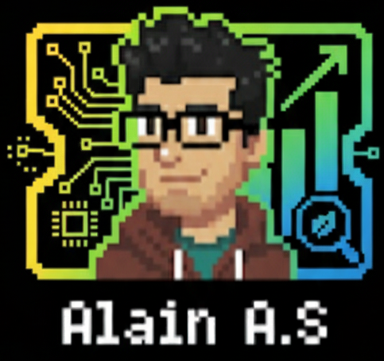

#  👋 Hola, soy **Alain**

🎓 **Doctor en Sostenibilidad** · 📊 **Mg. SIGC** · 🏗️ **Ingeniero Civil Ambiental** · 🧪 **Data Scientist**

🌱 *Integrando la sostenibilidad, los datos y la comunidad para un futuro mejor.*

---

## 🔗 Link portafolio

---

## 🧭 Sobre mí

💬 Profesional con formación avanzada en sostenibilidad, gestión ambiental y ciencia de datos, con más de 6 años de experiencia en proyectos públicos, análisis de datos e investigación aplicada.

✅ Especialista en liderar iniciativas de impacto comunitario, eficiencia operativa y educación ambiental, integrando habilidades técnicas con visión estratégica.

---

## 📚 Formación Académica

* 🎓 Doctor en Sostenibilidad — *UNICEPES, 2021 - 2023*
* 🎓 Magíster en Sistemas Integrados de Gestión — *Universidad Viña del Mar, 2019 - 2021*
* 🎓 Diplomado en Gestión Ambiental — *Universidad Andrés Bello, 2019*
* 🎓 Ingeniero Civil Ambiental — *Universidad de La Frontera, 2012 - 2018*
* 💻 Carrera Data Science — *Desafío Latam, 2024*

---

## 💼 Experiencia Profesional

* 🔽 **Jefe Técnico – CESFAM Cholchol** (2023 – Actualidad)
* 🔽 **Ingeniero – SECPLAN, Municipalidad de Cholchol** (2020 – 2023)
* 🔽 **Investigador – Universidad de La Frontera (FONDEF)** (2018 – 2019)

---

## 🏆 Proyectos y Portafolio

### 🚀 Apps en Streamlit

* **Programa Saludablemente Sorteo de Alianzas**
* **Análisis y Gestión de datos Salud**
* **Ingreso Automatizado**
* **Login Sistema de Turnos Farmacia**
  👉 [Explora mis aplicaciones](https://share.streamlit.io/user/antinaosdev)

### 📂 Repositorios en GitHub

* Modelos, notebooks y proyectos abiertos en ciencia de datos y sostenibilidad.
  👉 [Ver en GitHub](https://github.com/antinaosDev)

### 📜 Otros recursos

* [Capas SIG y Recursos Compartidos](https://www.notion.so/Capas-SIG-y-Recursos-Compartidos-1d80a081d9a98019b26be783c4babe30?pvs=21)

---

## 🧰 Tech Stack

**Lenguajes:** Python · SQL · R  
**Datos & ML:** Pandas · NumPy · Scikit-learn · MLflow · XGBoost  
**Viz:** Matplotlib · Seaborn · Plotly  
**Gestión:** Git/GitHub · DVC · Prefect · Excel VBA  
**Otros:** SPSS · Jupyter · Anaconda  

---

## 🏆 Métricas

---

## 📬 Contacto

📧 **Email:** [alain.antinao.s@gmail.com](mailto:alain.antinao.s@gmail.com)  
💼 **GitHub:** [antinaosDev](https://github.com/antinaosDev)  
🌍 Ubicado en Chile — Disponible para colaboraciones internacionales  

---

© 2025 Alain Antinao. Todos los derechos reservados.  
🌎 Recursos Descargables: [Capas SIG y Recursos Compartidos](https://www.notion.so/Capas-SIG-y-Recursos-Compartidos-1d80a081d9a98019b26be783c4babe30?pvs=21)
